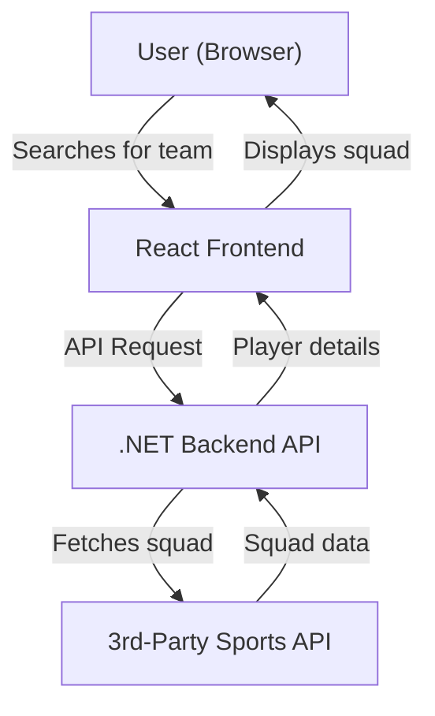
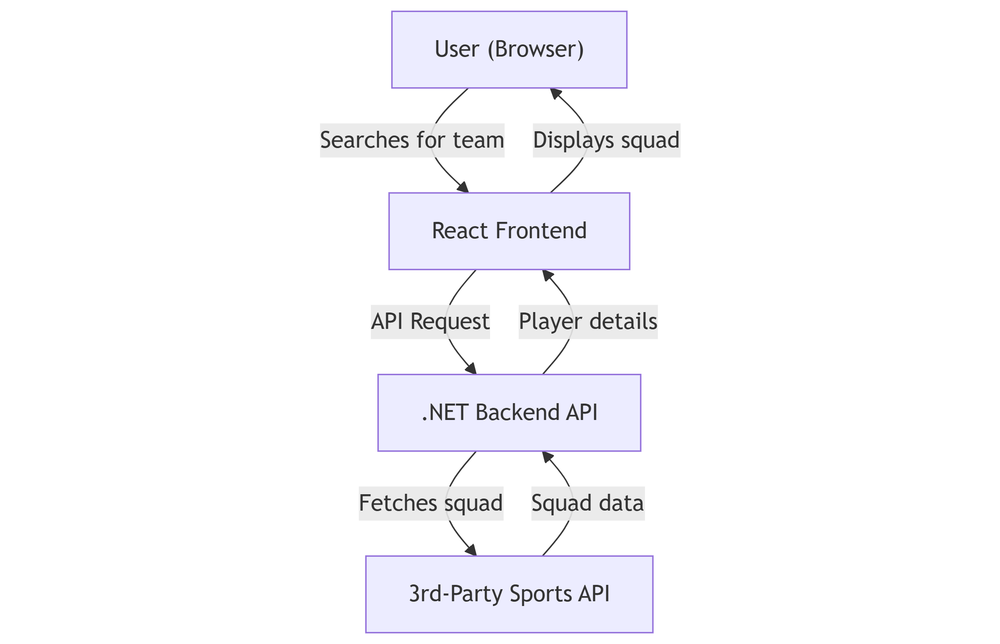

# TeamPeek High-Level Design Document

## Objectives
- Allow users to search for a Premier League team by name or nickname
- Display each player's profile picture, first name, surname, date of birth, and playing position
- Use React for the frontend and C#/.NET for the backend
- Integrate with a 3rd-party sports data API
- Deploy using CI/CD tooling (GitHub Actions + Azure)

## Solution Overview
- **Frontend (React):** Provides a user interface for searching teams and displaying squad details. Handles user input, communicates with the backend, and renders player information in a responsive layout.
- **Backend (C#/.NET):** Exposes a REST API endpoint to receive team queries, maps nicknames to official team names, fetches squad data from a 3rd-party sports API, and returns formatted player details to the frontend.
- **3rd-Party Integration:** Uses a sports data provider (e.g., TheSportsDB) to retrieve up-to-date squad information.
- **CI/CD:** Automated build and deployment pipeline using GitHub Actions and Azure Web Apps. See `.github/workflows/release.yml` for details.

## Technical Considerations

- Normalizes and validates player data from the external API.
- Implements error handling for invalid teams or API issues.

## High-Level Design

## Data Flow
1. User enters a team name or nickname in the frontend
2. Frontend sends a request to the backend API
3. Backend maps nickname (if needed) and queries the 3rd-party sports API
4. Backend processes and formats the squad data
5. Backend returns player details to the frontend
6. Frontend displays the squad information to the user

### CI/CD & Deployment
- GitHub Actions workflow automates build and deployment steps
- On push to `release/*` branches, the app is built and deployed to Azure Web App
- Secrets are managed securely in GitHub

## Technical Challenges & Considerations
- **3rd-Party API Limitations:** 
   - Another good option is https://api-football-v1.p.rapidapi.com. But free plans there do not have access to this season, only from 2021 to 2023.
   - TheSportsDB limits squad search to 10 players for free licence.
- **Nickname Mapping:** Ensuring comprehensive and accurate mapping was hard to achieve and requires further investigation. Nickname mapping support is limited or missing by most of free 3rd-Party APIs and thus was implemented from scratch. Nicknames dataset is quite small but should be enough to cover teams from EPL 24/25
- **Data Consistency:** Player data (e.g., missing images or positions) relies on 3rd party and might be missing for some players
- UI was implemented with a @mui/material to speed up the development.

## Conclusion
This design demonstrates the ability to:
- Build a POC with React and C#
- Integrate with 3rd-party APIs
- Deploy using CI/CD tooling
- Document and present the solution clearly 